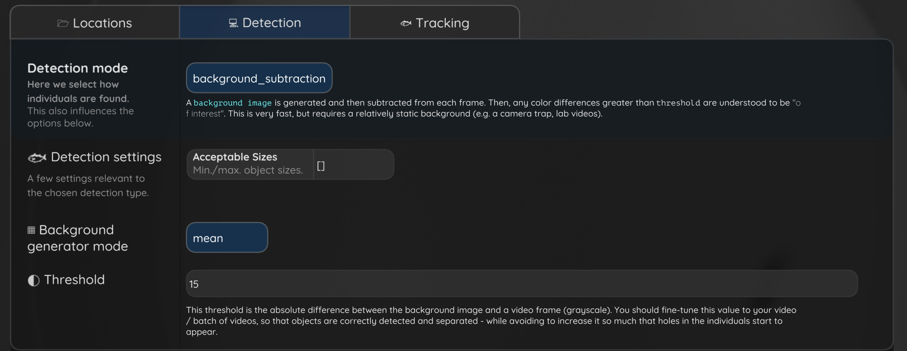
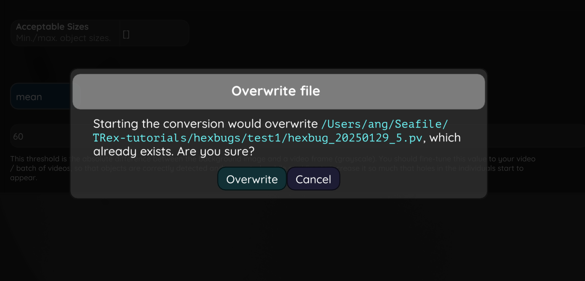

FAQ
=============================================

This page collects common questions and issues that may come up while using TRex for detection and tracking.
If you are just getting started, we recommend first reading the `Introduction to Tracking <1-intro-detection-tracking.rst>`_.

The questions below focus on typical problems during tracking, identity assignment, and parameter tuning.

Tracking issues
--------------------------------------

Why do object IDs change every frame or every few frames?
~~~~~~~~~~~~~~~~~~~~~~~~~~~~~~~~~~~~~~~~~~~~~~~~~~~~~~~~~

If objects are detected but the assigned ID changes very frequently, this usually means that TRex is unable to link detections reliably across consecutive frames.

This can happen for several reasons, but the most common are:

- ``track_max_speed`` is set too low
- ``track_max_individuals`` is incorrect
- detections are noisy or incomplete
- objects move too fast between frames
- the frame rate is too low for the behaviour being recorded

If ``track_max_speed`` is too low, TRex may assume that the object could not possibly have moved far enough between two frames, and the current tracklet will stop prematurely.
A new ID may then be assigned in the next frame.

If ``track_max_individuals`` is set incorrectly, TRex may struggle to maintain stable identities, especially when multiple objects are close to each other.

.. raw:: html

   

     <video controls playsinline width="640" src="_static/max_speed_nIDs.mov"></video>
   

**What to try:**

- increase ``track_max_speed`` gradually
- verify that ``track_max_individuals`` matches the real number of visible individuals
- check whether detections are consistent frame to frame (by switching between Track and Raw mode by pressing 'D' on the keyboard)
- increase frame rate in future recordings if movement is very fast
- inspect whether overlapping individuals are creating ambiguous detections

A good rule of thumb is: if identities are unstable, first check whether the tracker is being too restrictive.

The objects are tracked but sometimes stop and start again later
----------------------------------------------------------------

If you have already corrected ``track_max_individuals``, this issue may be caused by an incorrect value of ``track_max_speed``.

If ``track_max_speed`` is set too low, the tracklet may end too early because TRex assumes the object could not have moved far enough between consecutive frames.
When the object is detected again, TRex may start a new tracklet instead of continuing the previous one.

.. raw:: html

   

     <video controls playsinline width="640" src="_static/hexbug_20250129_5_example_max_speed.mp4"></video>
   

Try increasing ``track_max_speed`` so that it better reflects the maximum movement speed of your objects in the video.

In the detection phase, I see a lot of noise being tracked too
--------------------------------------------------------------

If your conversion you see a lot of noise that outercounts the real objects, this can be due to a low value of ``detect_threshold`` during conversion, or a low value of ``track_threshold`` during tracking.

.. raw:: html

   

     <video controls playsinline width="640" src="_static/hexbug_20250129_5_detection_noise.mp4"></video>
   

To reduce noise being tracked, we recommend first trying to remove it during the conversion phase, and then, if needed, also during the tracking phase.

1. Increase ``detect_threshold`` and convert again
~~~~~~~~~~~~~~~~~~~~~~~~~~~~~~~~~~~~~~~~~~~~~~~~~~

If your conversion has already run, go back to the menu, increase the value of ``detect_threshold``, and run the conversion again.

Increasing ``detect_threshold`` can help remove weak detections and reduce background noise already at the detection stage.

   Increasing ``detect_threshold`` can help suppress weak noisy detections during conversion.

   After changing any parameter in the 'Detection' section, you have to overwrite the existing file to apply the changes. This ensures that ``detect_threshold`` can help suppress weak noisy detections during conversion.

2. Increase ``track_threshold`` if noise is still tracked
~~~~~~~~~~~~~~~~~~~~~~~~~~~~~~~~~~~~~~~~~~~~~~~~~~~~~~~~~

If you already increased ``detect_threshold`` but still see noise during tracking, increase the value of ``track_threshold``.

This makes tracking more selective and can help prevent noisy detections from being continued as tracks.

.. raw:: html

   

     <video controls playsinline width="640" src="_static/hexbug_20250129_5_5_increasing_track_threshold.mp4"></video>
   

3. Check other tracking parameters if artefacts remain
~~~~~~~~~~~~~~~~~~~~~~~~~~~~~~~~~~~~~~~~~~~~~~~~~~~~~~

If the noise is gone but you still see other tracking artefacts, you may also need to adjust ``track_max_individuals`` and ``track_max_speed`` (see the previous FAQ entries).

These parameters affect how many individuals TRex expects and how far they are allowed to move between consecutive frames.